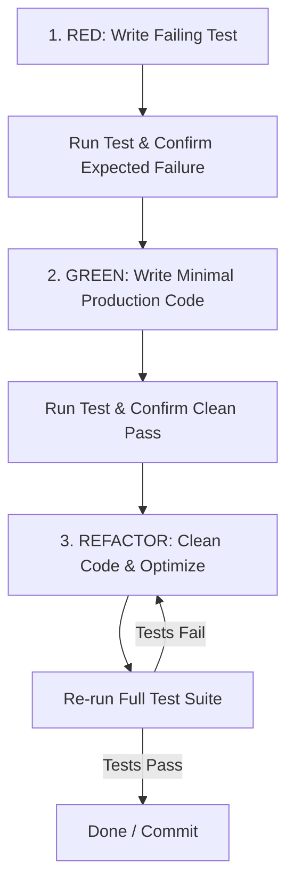

# TDD Workflows — Test-Driven Development for Agents 🧪

A rigorous testing skill that guides coding agents through test-driven development, preventing speculative implementations, hallucinated passes, and silent regressions.

---

## ⚡ Quick Install

```bash
npx skills add kipperdev/skillpper --skill tdd-workflows
```

---

## 🎯 Why TDD for AI Coding Agents?

AI coding assistants often fail by:
1. **Writing Code First, Testing Never**: Generating implementation code without running any tests, then asserting success in chat.
2. **False Green Tests**: Writing tests that pass vacuously (e.g., asserting mocks, missing assertions, or testing tautologies).
3. **Speculative Over-Engineering**: Writing hundreds of lines of untested boilerplate before verifying basic logic.
4. **Regression Blindness**: Fixing a bug in one file while silently breaking dependent modules.

The `tdd-workflows` skill enforces the classical **Red-Green-Refactor** discipline: every behavior change begins with an automated test that fails for the expected reason.

---

## ⚙️ Core Protocol: The Red-Green-Refactor Cycle



### Phase 1: RED (Write the Failing Test)
- **Identify Target Behavior**: Choose the smallest observable unit of behavior to implement or fix.
- **Write Test First**: Create or update the test file before creating or modifying production code.
- **Run the Test**: Execute the project's test command (e.g., `npm test`, `pytest`, `cargo test`, `go test`).
- **Verify Failure Mode**:
  - The test **MUST fail**.
  - The failure reason **MUST match the missing behavior** (e.g., `AssertionError: expected 'active' to equal 'pending'`, NOT an unexpected syntax error or missing runner configuration).

### Phase 2: GREEN (Implement Minimal Code)
- **Write Just Enough Code**: Implement only the minimal logic required to make the failing test pass.
- **Resist Speculation**: Do not add extra methods, unused parameters, or unrequested optimizations during this phase.
- **Run the Test**: Re-run the test command and confirm that the target test passes cleanly.
- **Run the Full Suite**: Confirm that existing unrelated tests did not break.

### Phase 3: REFACTOR (Improve Without Altering Behavior)
- **Eliminate Duplication**: Consolidate repetitive logic and clean up magic constants.
- **Improve Naming & Readability**: Refine variable, function, and interface names.
- **Verify Safety**: Run the test suite after every refactoring step. If any test fails, revert or adjust immediately.

---

## 🚫 Banned Anti-Patterns

- ❌ **Never Claim Tests Pass Without Running Them**: You must execute the test runner via the terminal and observe the output before stating success.
- ❌ **Never Skip the RED Phase**: If a newly written test passes before you touched production code, either the test is invalid or the feature is already implemented.
- ❌ **No Tautological Assertions**: Avoid useless assertions like `expect(true).toBe(true)` or `assert result is not None` when checking specific data contracts.
- ❌ **No Heavy Mocking of Tested Units**: Never mock the exact unit or logic under test. Mocks should only isolate external network, disk, or clock boundaries.

---

## 🛠️ Stack Quick Reference

| Language / Stack | Test Runner Command | Watch / Filter Flag |
| :--- | :--- | :--- |
| **Node / TypeScript** | `npm test` / `pnpm test` / `bun test` | `npm test -- -t "test-name"` / `vitest run <file>` |
| **Python** | `pytest` / `python -m unittest` | `pytest -k "test_name"` / `pytest tests/test_foo.py` |
| **Go** | `go test ./...` | `go test -run TestName ./pkg/...` |
| **Rust** | `cargo test` | `cargo test test_name` |

---

## 📚 Supporting References

- [Red-Green-Refactor In-Depth Guide](references/red-green-refactor.md)
- [Testing Anti-Patterns & Pitfalls to Avoid](references/testing-anti-patterns.md)
